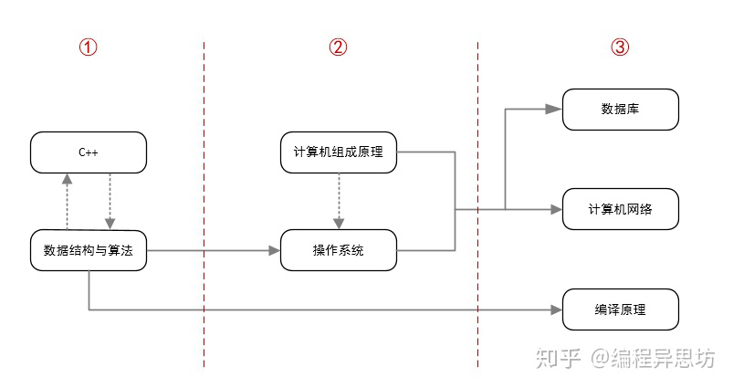

# 计算机科学

## 要学的东西

数据结构

计算机组成原理

操作系统

计算机网络

[正则表达式](https://github.com/jaywcjlove/linux-command)

CSAPP

程序员基础课（极客时间）：程序员数学 | 程序员英语

## 书

《大话数据结构》

《深入理解计算机系统》（csapp）

《C Primer Plus》

《刻意练习》

《算法导论》

《算法设计手册》
